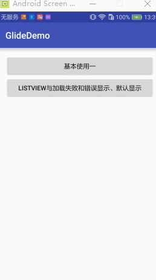
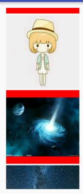

## Glide入门教程一（基本使用）

### 添加依赖
```
compile 'com.github.bumptech.glide:glide:3.7.0'
```

### 简单介绍

* with(Context context)- Context是许多Android API需要调用的， Glide也不例外。这里Glide非常方便，你可以任意传递一个Activity或者Fragment对象，它都可以自动提取出上下文。
* load(String imageUrl) - 这里传入的是你要加载的图片的URL，大多数情况下这个String类型的变量会链接到一个网络图片。
* into(ImageView targetImageView) - 将你所希望解析的图片传递给所要显示的ImageView


### 加载url网络图片
* 权限
```
<uses-permission android:name="android.permission.INTERNET"/>
```
* 加载图片

```
 Glide.with(this).load("http://img1.imgtn.bdimg.com/it/u=2615772929,948758168&fm=21&gp=0.jpg").into(mIv1);
```
这几行！如果这个URL链接的图片的确存在，并且你的ImageView可见，你将会在1~2秒见到这张图片被加载。假如这张图片不存在，Glide会回调相应的出错接口下面说


### 加载本地图片

* File 文件
```
 //本地图片路径 /storage/emulated/0/1470634823290.jpg
        String path ="/storage/emulated/0/1470634823290.jpg";

        File file = new File(path);

        Glide.with(this).load(file).into(mIv3);
```
* 转换的URI
```
 //本地图片路径 /storage/emulated/0/1470634823290.jpg
        String path ="/storage/emulated/0/1470634823290.jpg";

        File file = new File(path);

       // Glide.with(this).load(file).into(mIv3);
        Uri uri = Uri.fromFile(file);


       Glide.with(this).load(uri).into(mIv3);
```
如果图片不显示建议设置要控件的宽与高，后面再说怎么解决


### 加载资源图片
这里是一个Int型的的资源id。
```
Glide.with(this).load(R.mipmap.test).into(mIv2);
```


-------


## Glide入门教程二ListView中使用


### 添加RecyclerView

* 准备数据

```

    /**
     * 准备数据
     */
    String [] mDatas = new String[]{

            "http://b337.photo.store.qq.com/psb?/V10FcMmY1Ttz2o/7.fo01qLQ*SI59*E2Wq.j82HuPfes*efgiyEi7mrJdk!/b/dLHI5cioAQAA&bo=VQOAAgAAAAABB*Q!&rf=viewer_4",
            "http://b118.photo.store.qq.com/psb?/V10FcMmY2gHuOI/8*6eK6PHCNTx1utXooId*KAWgwPTllj.b6uBg4McCwM!/b/dAt8W0YJJAAA&bo=VQOAAgAAAAABB*Q!&rf=viewer_4",
            "http://img1.imgtn.bdimg.com/it/u=488611129,2377736106&fm=11&gp=0.jpg",
            "http://img2.imgtn.bdimg.com/it/u=3398443685,2594061265&fm=11&gp=0.jpg",
            "http://img3.imgtn.bdimg.com/it/u=2271902832,1324672617&fm=21&gp=0.jpg",
            "http://a.hiphotos.baidu.com/image/h%3D200/sign=d20242020e24ab18ff16e63705fae69a/267f9e2f070828389f547b30bf99a9014c08f1bd.jpg",
            "http://img5.duitang.com/uploads/item/201406/28/20140628132554_UNE4n.thumb.700_0.jpeg",
            "http://cdn.duitang.com/uploads/item/201309/22/20130922202150_ntvAB.thumb.600_0.jpeg",
            "http://cdn.duitang.com/uploads/item/201208/04/20120804013554_yRGfe.jpeg",
            "http://img5.imgtn.bdimg.com/it/u=2050390856,2980742959&fm=21&gp=0.jpg",
            "http://img3.duitang.com/uploads/item/201501/23/20150123204322_N8nw5.jpeg",
            "http://img4q.duitang.com/uploads/item/201505/09/20150509204813_nEwxF.jpeg",
            "http://img1.imgtn.bdimg.com/it/u=2432702027,3704029716&fm=21&gp=0.jpg",
            "http://i.imgur.com/syELajx.jpg",
            "http://i.imgur.com/COzBnru.jpg",
            "http://i.imgur.com/Z3QjilA.jpg"


    };
```
* Activity

```
 private void initData() {


        mGlideListUseAdapter = new GlideListUseAdapter(this,mDatas);

        LinearLayoutManager linearLayoutManager = new LinearLayoutManager(this,LinearLayoutManager.VERTICAL,false);

        mRecyclerView.setLayoutManager(linearLayoutManager);


        mRecyclerView.setAdapter(mGlideListUseAdapter);


    }
```

* adapter

> 布局
```


    <ImageView
               android:layout_margin="2dp"
               android:id="@+id/iv"
               android:layout_width="200dp"
               android:layout_height="200dp">

    </ImageView>
```

> adapter
```android
public class GlideListUseAdapter extends RecyclerView.Adapter<GlideListUseAdapter.ViewHolder> {


    Context      mContext;
    String [] mDatas;

    LayoutInflater mInflater;

    public GlideListUseAdapter(Context context, String [] datas) {
        this.mContext = context;
        this.mDatas = datas;
        mInflater= LayoutInflater.from(context);
    }

    @Override
    public ViewHolder onCreateViewHolder(ViewGroup parent, int viewType) {

        View itemView = mInflater.inflate(R.layout.item_glide_list_use,parent,false);

        return new ViewHolder(itemView);
    }

    @Override
    public void onBindViewHolder(ViewHolder holder, int position) {

        String url = mDatas[position];


        Glide.with(mContext).load(url).into(holder.mIv);

    }

    @Override
    public int getItemCount() {
        if(mDatas!=null){

           return mDatas.length;
        }
        return 0;
    }

    public class  ViewHolder extends RecyclerView.ViewHolder {
        ImageView mIv;
        public ViewHolder(View itemView) {

            super(itemView);

            mIv = (ImageView) itemView.findViewById(R.id.iv);
        }
    }
}

```

这样图片就显示出来了

## Glide入门教程三 占位图-淡入淡出效果-添加动画

* 占位图
网络的环境不好，加载过程可能需要花费大量的时间。这时候就需要一个占位图先显示出来，直到实际的图片加载并处理完毕。

```
Glide.with(mContext) //上下文
                .load(url) //图片地址
                .placeholder(R.mipmap.pictures_no) //占位图
                .into(holder.mIv); //显示在哪个控件中
```

* 出错的占位图 .error()
假设我们的app尝试从网页加载一张图片，但网页不可访问,Glide会给我们选项去进行出错的回调，并采取合适的行动

```
  Glide.with(mContext) //上下文
                .load(url) //图片地址
                .placeholder(R.mipmap.pictures_no) //占位图
                .error(R.mipmap.ic_launcher)  //出错的占位图
                 .into(holder.mIv); //显示在哪个控件中
```

加载前显示placeholder中的图片资源，加载失败就显示error中的图片资源
error()可以接受的只能是已经被初始化的图片资源或者指向图片资源的id

### 渐变动画 .crossFade()

crossFade()
```

        Glide.with(mContext) //上下文
                .load(url) //图片地址
                .placeholder(R.mipmap.pictures_no) //占位图
                .error(R.mipmap.ic_launcher)  //出错的占位图
                .crossFade(5000)                 //淡入淡出 可以不写默认300
                 .into(holder.mIv); //显示在哪个控件中
```

淡入淡出 -不写默认也会有值是300毫秒
crossFade()方法有另外一个特征：.crossFade(int duration),如果你想要减慢（或加快）动画，随便传入一个毫秒级的时间进去感受一下。


#### dontAnimate()的使用
如果你只是直接显示图片，而不需要crossfade效果，那就在Glide的请求构造里调用.dontAnimate()


### animate 添加自定义的动画

```
<?xml version="1.0" encoding="utf-8"?>
<set xmlns:android="http://schemas.android.com/apk/res/android">

    <alpha android:fromAlpha="0"
           android:duration="3000"
            android:toAlpha="1"/>

    <scale android:fromXScale="0"
           android:fromYScale="0"
           android:pivotX="50%"
           android:pivotY="50%"
           android:toXScale="100%"
           android:toYScale="100%"
           android:duration="3000"/>

    <rotate android:pivotY="50%"
            android:pivotX="50%"
            android:fromDegrees="30"
            android:toDegrees="360"
            android:duration="3000"
        />

</set>
```

* 添加
```

        Glide.with(mContext) //上下文
                .load(url) //图片地址
                .placeholder(R.mipmap.pictures_no) //占位图
                .error(R.mipmap.ic_launcher)  //出错的占位图

                .animate(R.anim.my_alpha)
                 .into(holder.mIv); //显示在哪个控件中

```


这些参数都是独立的，并且设置不依赖彼此。例如，你可以只设置.error()，而不用调用.placeholder()。你可以设置crossFade()动画，而不用设置占位图。参数的任意结合都是可行的


## Glide入门教程四-调整图片大小

### 调整图片大小 override()

Picasso也有同样的能力,resize(x, y)但需要调用fit()方法

用Glide时，如果图片不需要自动适配ImageView，调用override(horizontalSize, verticalSize)，它会在将图片显示在ImageView之前调整图片的大小。

```
   int width = (int) TypedValue.applyDimension(TypedValue.COMPLEX_UNIT_DIP, 200, mContext.getResources().getDisplayMetrics());
        int height   = (int) TypedValue.applyDimension(TypedValue.COMPLEX_UNIT_DIP, 200f, mContext.getResources().getDisplayMetrics());
        Glide.with(mContext) //上下文
                .load(url) //图片地址
                .placeholder(R.mipmap.pictures_no) //占位图
                .error(R.mipmap.ic_launcher)  //出错的占位图
                .override(width,height) //图片显示的分辨率 ，像素值 可以转化为DP再设置
                .animate(R.anim.my_alpha)

                 .into(holder.mIv); //显示在哪个控件中

```

### 缩放图片-centerCrop

Glide提供了变换去处理图片显示，通过设置centerCrop 和 fitCenter，可以得到两个不同的效果。


CenterCrop()会缩放图片让图片充满整个ImageView的边框，然后裁掉超出的部分。ImageVIew会被完全填充满，但是图片可能不能完全显示出。
```
  String url = mDatas[position];


        int width = (int) TypedValue.applyDimension(TypedValue.COMPLEX_UNIT_DIP, 200, mContext.getResources().getDisplayMetrics());
        int height   = (int) TypedValue.applyDimension(TypedValue.COMPLEX_UNIT_DIP, 200f, mContext.getResources().getDisplayMetrics());
        Glide.with(mContext) //上下文
                .load(url) //图片地址
                .placeholder(R.mipmap.pictures_no) //占位图
                .error(R.mipmap.ic_launcher)  //出错的占位图
                .override(width,height) //图片显示的分辨率 ，像素值 可以转化为DP再设置
                .animate(R.anim.my_alpha)
                .centerCrop()
                 .into(holder.mIv); //显示在哪个控件中

```


### 缩放图片-fitCenter
为ImageView加个背景色
```xml

    <ImageView
        android:background="#ff0000"
               android:layout_margin="2dp"
               android:id="@+id/iv"
               android:layout_width="200dp"
               android:layout_height="200dp"/>
```

fitCenter()会缩放图片让两边都相等或小于ImageView的所需求的边框。图片会被完整显示，可能不能完全填充整个ImageView。

```
Glide.with(mContext) //上下文
                .load(url) //图片地址
                .placeholder(R.mipmap.pictures_no) //占位图
                .error(R.mipmap.ic_launcher)  //出错的占位图
                .override(width,height) //图片显示的分辨率 ，像素值 可以转化为DP再设置
                .animate(R.anim.my_alpha)
                .centerCrop()
                .fitCenter()
                 .into(holder.mIv); //显示在哪个控件中
```





centerCrop-fitCenter会相互覆盖，后面调用的后覆盖前面调用的效果


## Glide入门教程五-加载gif-视频快照-缩略图

### 播放 网络Gif动画

```
 //加载网络gif
        String gifUrl = "http://b.hiphotos.baidu.com/zhidao/pic/item/faedab64034f78f066abccc57b310a55b3191c67.jpg";
        Glide.with(this).load(gifUrl).placeholder(R.mipmap.pictures_no).into(mIv4);
```

### 本地资源gif

```
 //加载资源gif
        Glide.with(this).load(R.mipmap.loading).asGif().placeholder(R.mipmap.pictures_no).into(mIv5);

```

### 加载本地gif文件


```

        //加载本地gif文件
        String gifPath = Environment.getExternalStorageDirectory().getAbsolutePath()+"/Movies/test.gif";
        //test.gif  animate.gif Starry_Night.mp4 test.mp4

        File gifFile = new File(gifPath);

        Glide.with(this).load(gifFile).placeholder(R.mipmap.ic_launcher).into(mIv6);

```

### 加载本地视频快照

```
 //加载本地小视频 快照，只是快照 并不能播放
        String videoPath =Environment.getExternalStorageDirectory().getAbsolutePath()+"/Movies/test.mp4";;

        File videoFile = new File(videoPath);

        Glide.with(this).load(Uri.fromFile(videoFile)).placeholder(R.mipmap.ic_launcher).into(mIv7);
```

### 加载缩略图一


如果你传递一个0.1f作为参数，Glide会加载原始图片大小的10%的图片。如果原始图片有1000x1000像素，缩略图的分辨率为100x100像素

```
String urlPath="/storage/emulated/0/MagazineUnlock/magazine-unlock-03-2.3.311-bigpicture_03_20.jpg";
        //第一种 设置缩略图比例
        Glide.with(this).load(new File(urlPath)).thumbnail(0.1f).centerCrop().placeholder(R.mipmap.pictures_no).into(mIv8);
```

### 加载缩略图二 高级缩略图请求：原图与缩略图完全不同

```
 //先建立一个缩略图对象 先加载缩略图，再加载原图
        DrawableRequestBuilder thumbnailRequest=  Glide.with(this).load("http://img1.imgtn.bdimg.com/it/u=2615772929,948758168&fm=21&gp=0.jpg");

        Glide.with(this).load(Uri.fromFile(videoFile)).thumbnail(thumbnailRequest).centerCrop().placeholder(R.mipmap.pictures_no).into(mIv9);
```


## Glide入门教程六-缓存基础


Glide默认使用内存和磁盘缓存来避免不必要的网络请求,所有的图片请求都会被缓存在内存和磁盘上.

* 内存缓存
```
 Glide.with(this)
                .load(url10)
                .placeholder(R.mipmap.pictures_no)
                .skipMemoryCache(true)   //跳过内存缓存，不在内存中保存图片
                .into(mIv10);
```

调用了.skipMemoryCache( true )去特意告诉Glide跳过内存缓存。这意味着Glide不会把这个图片缓存到内存里。重要是，这个只影响内存缓存！Glide为了避免以后的网络请求，仍然会缓存到磁盘。
由于Glide默认会将所有的图片资源缓存到内存中，因此，没有必要手动调用.skipMemoryCache( false )了


* 跳过磁盘缓存

即使你关闭了内存缓存，所请求的图片仍然会被保存在设备的磁盘存储上。如果你有一张不段变化的图片，但是都是用的同一个URL，你可能需要禁止磁盘缓存了。
可以用.diskCacheStrategy()方法改变Glide的行为。不同于.skipMemoryCache()方法，它将需要从枚举型变量中选择一个，而不是一个简单的boolean。如果你想要禁止请求的磁盘缓存，使用枚举型变量DiskCacheStrategy.NONE作为参数

```
 Glide.with(this)
                .load(url10)
                .placeholder(R.mipmap.pictures_no)

                .skipMemoryCache(true)   //跳过内存缓存，不在内存中保存图片
                .diskCacheStrategy(DiskCacheStrategy.NONE)  //跳这磁盘缓存
                .into(mIv10);
```
* DiskCacheStrategy

    * DiskCacheStrategy.NONE 不在磁盘下保存图片没有磁盘缓存
    * DiskCacheStrategy.SOURCE 只缓存全尺寸图，原图是多大就保存多大
    * DiskCacheStrategy.RESULT 只缓存最终降低分辨后用到的图片   例:  .override(300,300),300*300像素
    * DiskCacheStrategy.ALL 缓存所有类型的图片 (默认行为)

官方wiki<https://github.com/bumptech/glide/wiki/Caching-and-Cache-Invalidation>

## Glide入门教程七-图片请求优先级
.priority()方法参数的Priority的枚举变量
一共有四个不同的枚举变量。下面以递增方式列出：

	* Priority.LOW
	* Priority.NORMAL
	* Priority.HIGH
	* Priority.IMMEDIATE

```
 Glide.with(this)
                .load(url10)
                .placeholder(R.mipmap.pictures_no)
                .override(300,300)
                .skipMemoryCache(true)   //跳过内存缓存，不在内存中保存图片
                .diskCacheStrategy(DiskCacheStrategy.ALL)
                .priority(Priority.HIGH)   //添加高优先级
                .into(mIv10);

 Glide
.with( context )
.load( url10 )
.priority( Priority.LOW )
.into( imageViewLowPrioLeft );

Glide
    .with( context )
    .load( url10 )
    .priority( Priority.LOW )
    .into( imageViewLowPrioRight );
```


## Glide入门教程八-回调：定制view中使用SimpleTarget和ViewTarget


* Glide中的回调：Target

假设我们并没有ImageView作为图片加载的目标。我们只需要Bitmap本身。Glide提供了一个用Target获取Bitmap资源的方法。Target只是用来回调，它会在所有的加载和处理完毕时返回想要的结果。


```
   String url1 = "http://img4.imgtn.bdimg.com/it/u=21385237,1665284751&fm=21&gp=0.jpg";

        /**
         * 代码的第一部分，创建一个target字段对象，里面定义了个方法，
         * 这个方法一旦Glide加载和处理完图片将会被调用。
         * 回调方法传回Bitmap作为参数，你可以在你所需要用的地方随意使用这个Bitmap对象。
         */
        SimpleTarget<Bitmap> target = new SimpleTarget<Bitmap>() {
            @Override
            public void onResourceReady(Bitmap resource, GlideAnimation<? super Bitmap> glideAnimation) {

                //设置图片显示
                mIvt1.setImageBitmap(resource);
            }
        };

        Glide.with(this).load(url1)
                .asBitmap() //作为bitmap显示
                .into(target); //显示在这个对象
```


代码的第二部分，表明了Glide里如何使用Target，明显跟ImageView一样！
你可以传递一个Target或者ImageView作为参数到.into()方法里。
Glide会神奇地将结果返回。这里有个不同点，我们添加了.asBitmap()，
这会强制返回一个Bitmap对象。
记住，Glide也可以加载Gif或视频。为了防止在从网络URL（可能是GIF）获取Bitmap时，
出现未知格式图片冲突（期望是Bitmap），
我们设置.asBitmap()去告诉Glide只有在资源是一个图片是才算成功，其他的都算解析失败。

* 特定大小的Target

```
  /**
         *  通过构造方法设置图片大小
         */
        SimpleTarget<Bitmap> target2 = new SimpleTarget<Bitmap>(300,300) {
            @Override
            public void onResourceReady(Bitmap resource, GlideAnimation<? super Bitmap> glideAnimation) {
                //设置图片显示
                mIvt2.setImageBitmap(resource);
            }
        };

        Glide.with(this).load(url2)
                .asBitmap() //作为bitmap显示
                .into(target2); //显示在这个对象

```
和“普通”target唯一不同的是这个以像素为单位的图片大小声明
```
 new SimpleTarget<Bitmap>(300,300)
```

* ViewTarget

有很多原因导致我们不能直接使用ImageView,由于没有已知的方法在哪里设置图片，Glide并不支持加载图片到定制的View内。然而用ViewTarget会让这个更简单。
假设你有个自定义的View
```
public class FutureStudioView extends FrameLayout {
    ImageView iv;
    TextView tv;

    public void initialize(Context context) {
        inflate( context, R.layout.custom_view_futurestudio, this );

        iv = (ImageView) findViewById( R.id.custom_view_image );
        tv = (TextView) findViewById( R.id.custom_view_text );
    }

    public FutureStudioView(Context context, AttributeSet attrs) {
        super( context, attrs );
        initialize( context );
    }

    public FutureStudioView(Context context, AttributeSet attrs, int defStyleAttr) {
        super( context, attrs, defStyleAttr );
        initialize( context );
    }

    public void setImage(Drawable drawable) {
        iv = (ImageView) findViewById( R.id.custom_view_image );

        iv.setImageDrawable( drawable );
    }
}
```
由于我们定制的view并不是继承自ImageView，这里不能使用常规的.into()方法。因此，我们只能创建一个ViewTarget，用来传递给.into()方法：


```
private void loadImageViewTarget() {
 String targetUrl = "http://photo.enterdesk.com/2009-4-21/200901241609531378.png";
    FutureStudioView customView = (FutureStudioView) findViewById( R.id.custom_view );

    viewTarget = new ViewTarget<FutureStudioView, GlideDrawable>( customView ) {
        @Override
        public void onResourceReady(GlideDrawable resource, GlideAnimation<? super GlideDrawable> glideAnimation) {
            this.view.setImage( resource.getCurrent() );
        }
    };

    Glide.with(this)
                   .load(targetUrl)
                   .centerCrop()
                   .override(300,300)
                   //显示自定义控件中
                   .into(viewTarget);

}
```


在target的回调方法中，我们在定制view上使用我们创建的setImage(Drawable drawable)方法设置图片。同时，确保你注意到我们已经在ViewTarget的构造方法里传递了我们的定制view:new ViewTarget<FutureStudioView, GlideDrawable>( customView )。


## Glide入门教程九-通知栏和桌面小控件的图片加载

## Glide入门教程十-异常: 调试和报错处理

## Glide入门教程十一-自定义变换


源码
<https://github.com/ln0491/GlideDemo>>


